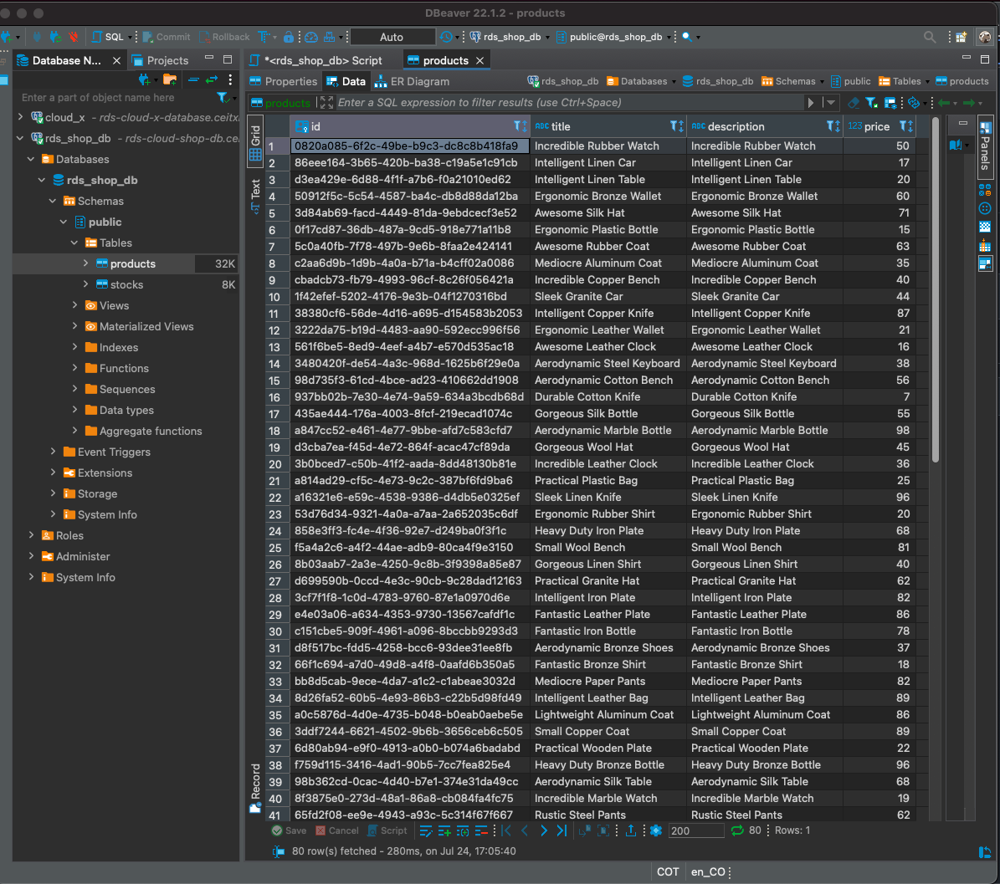
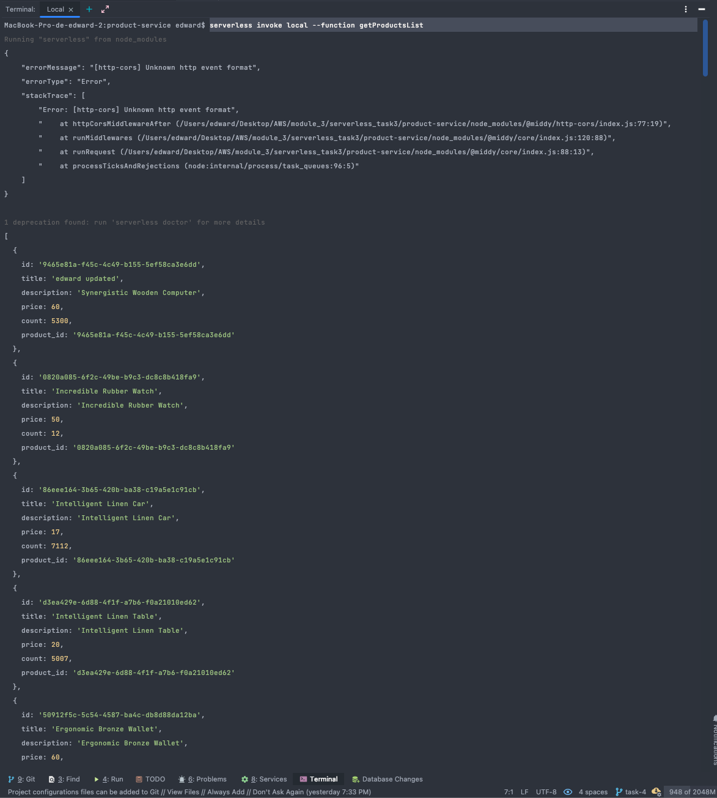

### U can find the script with the data in the file script.sql 

### connected from dbeaver 

### get data from lambda function 

# Back Shop Angular Cloudfront

### Api products
#### [Get All products](https://406dm9u6e2.execute-api.us-east-1.amazonaws.com/dev/products)
#### [Get Product by id](https://406dm9u6e2.execute-api.us-east-1.amazonaws.com/dev/products/71d417c5-8ab8-4903-8e66-21576810562a)

### Swagger
#### [Swagger](https://j1wpqwybt2.execute-api.us-east-1.amazonaws.com/dev/swagger)
#### [Swagger.json](https://j1wpqwybt2.execute-api.us-east-1.amazonaws.com/dev/swagger.json)

### FrontEnd Proyect (consuming api from AWS )
#### [FrontEnd Proyect](https://d2m1blxnzf7v4s.cloudfront.net/)

**_`Edward fuentes`_**
